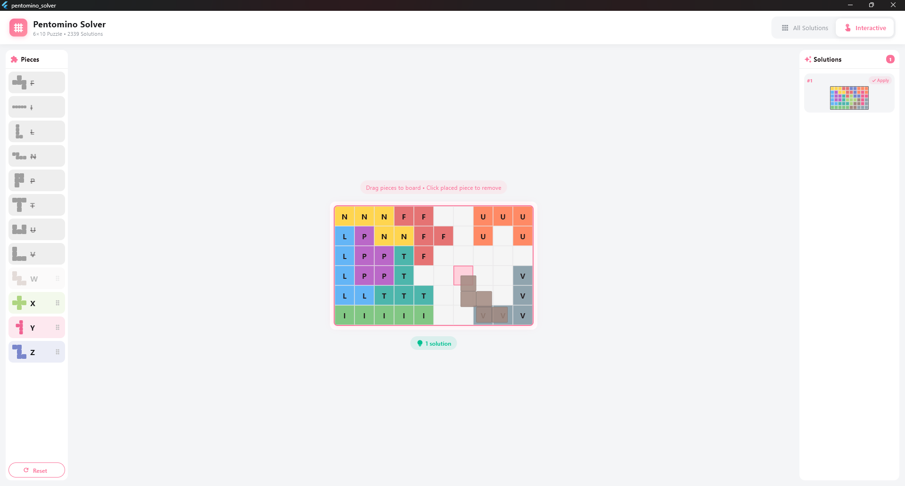
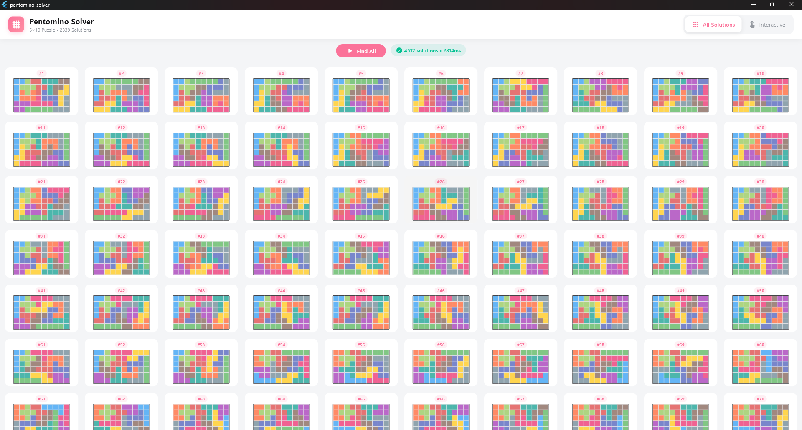
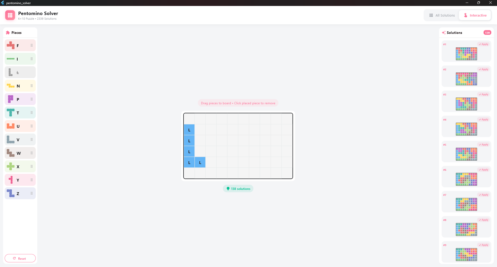

<p align="center">
  
</p>

<h1 align="center">Pentomino Solver</h1>

<p align="center">
  A fast and elegant pentomino puzzle solver built with Flutter.<br>
  Solves the classic 6×10 board with all 2339 unique solutions.
</p>

<p align="center">
  <a href="https://911218sky.github.io/pentomino-solver/">
    
  </a>
  <a href="https://github.com/911218sky/pentomino-solver/releases">
    
  </a>
  <a href="https://github.com/911218sky/pentomino-solver/blob/main/LICENSE">
    
  </a>
</p>

<p align="center">
  <a href="https://911218sky.github.io/pentomino-solver/">🎮 Try the Live Demo</a>
</p>

## Screenshots

<p align="center">
  
  &nbsp;&nbsp;
  
</p>

<p align="center">
  
</p>

## Features

- **DLX Algorithm** — Uses Dancing Links (Algorithm X) for blazing-fast solving
- **All Solutions View** — Browse through all 2339 unique solutions
- **Interactive Mode** — Place pieces manually and find valid completions
- **Real-time Solving** — Watch solutions generate in milliseconds
- **Clean UI** — Modern, minimalist design with smooth animations

## Download

Get the latest release from [Releases](https://github.com/911218sky/pentomino-solver/releases).

| Platform | File |
|----------|------|
| Windows | `Pentomino-windows-x64.zip` |
| macOS | `Pentomino-macos.zip` |
| Linux | `Pentomino-linux-x64.tar.gz` |

## What is Pentomino?

Pentominoes are geometric shapes formed by joining five unit squares edge to edge. There are 12 distinct pentomino pieces (F, I, L, N, P, T, U, V, W, X, Y, Z), and together they cover exactly 60 squares — perfectly fitting a 6×10 rectangle.

This puzzle has exactly **2339 unique solutions** (excluding rotations and reflections).

## Development

### Requirements

- Flutter 3.24.0+
- Dart 3.0.0+

### Setup

```bash
git clone https://github.com/911218sky/pentomino-solver.git
cd pentomino-solver
flutter pub get
flutter run
```

### Build

```bash
# Windows
flutter build windows --release

# macOS
flutter build macos --release

# Linux
flutter build linux --release
```

## Tech Stack

- **Framework**: Flutter
- **Algorithm**: Dancing Links (DLX) / Algorithm X
- **Language**: Dart

## License

[GNU](LICENSE)
